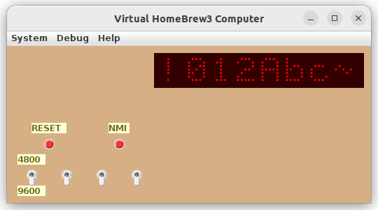

# homebrew3

This project is for this
[VCFED discussion thread](https://forum.vcfed.org/index.php?threads/homebrew-z80-no-3.1240919/).

Photos of the computer are on this
[Google Drive](https://drive.google.com/drive/folders/1JXV017_ggF-4IG32N2BlPU1Jmj1P-w-M).

Documentation:

 * [Schematics](kicad/homebrew3.pdf)
 * [Layout/BOM](kicad/perfboard-layout.pdf)
 * [Monitor ROM](doc/MonitorROM.pdf)

